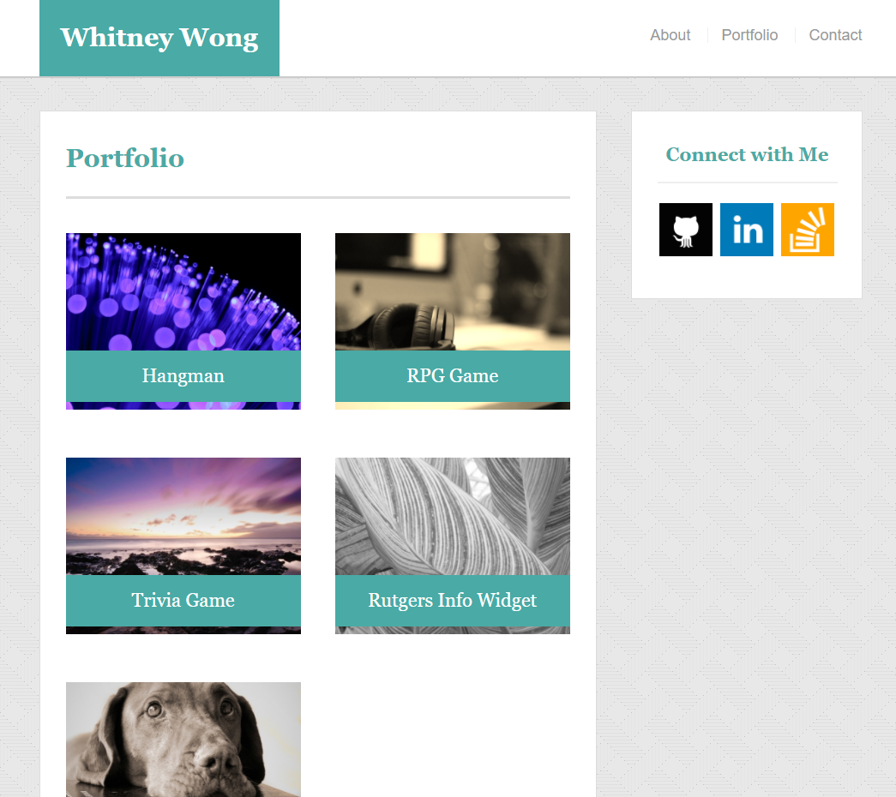
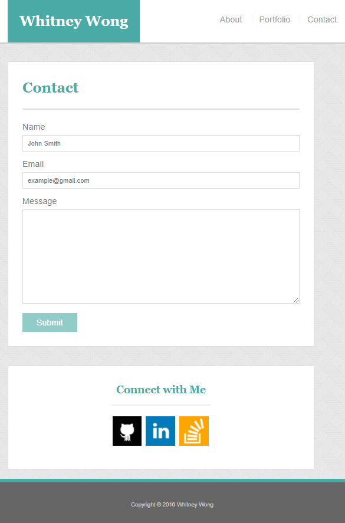
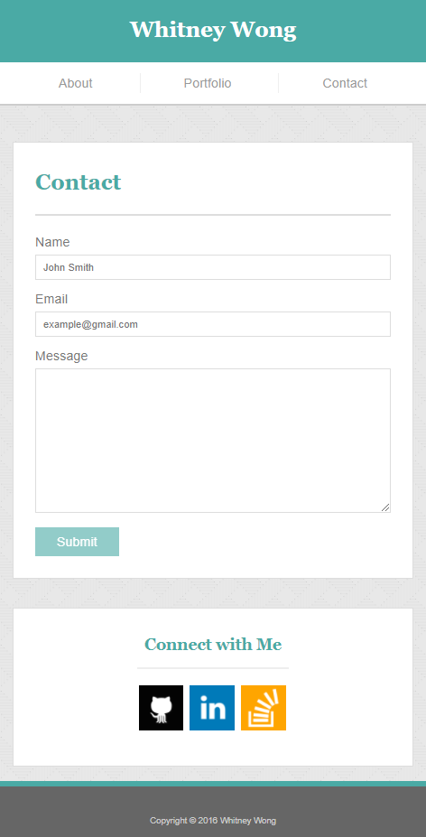

# Responsive-Portfolio
Created a media responsive portfolio using a template to guide the look of each html page. This project contains an index.html, portfolio.html, and contact.html page.

Technology used to make this project: HTML, CSS, and media queries.

Below are screenshots of each html page:
### Index
###### Index at 980px

###### Index at 768px
 
###### Index at 640px
 

- - -

### Portfolio
###### Index at 980px

###### Index at 768px
 
###### Index at 640px
 

- - - 

### Contact
###### Index at 980px

###### Index at 768px
 
###### Index at 640px
 